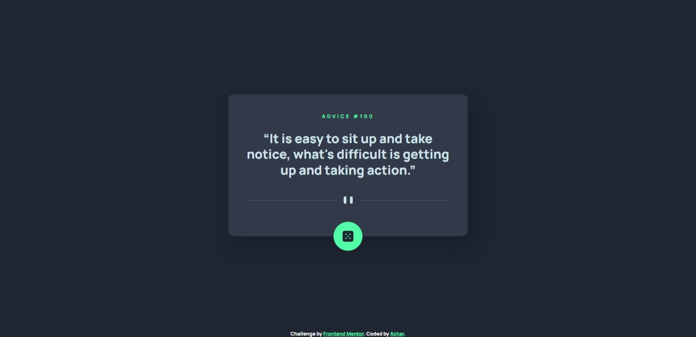

# Frontend Mentor - Advice generator app solution

This is a solution to the [Advice generator app challenge on Frontend Mentor](https://www.frontendmentor.io/challenges/advice-generator-app-QdUG-13db). Frontend Mentor challenges help you improve your coding skills by building realistic projects.

## Table of contents

- [Overview](#overview)
  - [The challenge](#the-challenge)
  - [Screenshot](#screenshot)
  - [Links](#links)
- [My process](#my-process)
  - [Built with](#built-with)
  - [What I learned](#what-i-learned)
  - [Useful resources](#useful-resources)
- [Author](#author)

**Note: Delete this note and update the table of contents based on what sections you keep.**

## Overview

### The challenge

Users should be able to:

- View the optimal layout for the app depending on their device's screen size
- See hover states for all interactive elements on the page
- Generate a new piece of advice by clicking the dice icon

### Screenshot



### Links

- Solution URL: [Github code link](https://github.com/azhar1038/frontendmentor/tree/main/advice-generator-app)
- Live Site URL: [Github page link](https://azhar1038.github.io/frontendmentor/advice-generator-app)

## My process

### Built with

- Semantic HTML5
- CSS custom properties
- Flexbox
- CSS Grid
- Vanilla JS
- Event handler

### What I learned

- `animationiteration` event handler
- How to add event listener only for one time
- How to stop css animation after completing the current iteration
```js
  myElement.addEventListener('animationiteration', (e) => {
    // Stop animation by removing class or data attributes
  }, {
    once: true
  });
```

### Useful resources

- [Stack overflow](https://stackoverflow.com/a/13061553/11828315) - Stopping a CSS animation but letting its current iteration finish
- [Stack overflow](https://stackoverflow.com/a/36312421/11828315) - JS equivalent for jQuery one()

## Author

- Github - [Md Azharuddin](https://github.com/azhar1038)
- Frontend Mentor - [@azhar1038](https://www.frontendmentor.io/profile/azhar1038)
