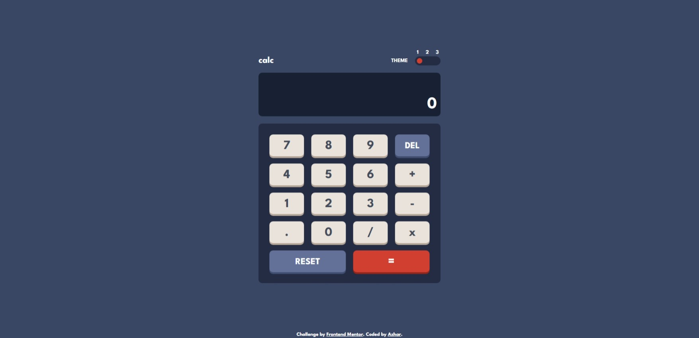

# Frontend Mentor - Calculator app solution

This is a solution to the [Calculator app challenge on Frontend Mentor](https://www.frontendmentor.io/challenges/calculator-app-9lteq5N29). Frontend Mentor challenges help you improve your coding skills by building realistic projects. 

## Table of contents

- [Overview](#overview)
  - [The challenge](#the-challenge)
  - [Screenshot](#screenshot)
  - [Links](#links)
- [My process](#my-process)
  - [Built with](#built-with)
  - [What I learned](#what-i-learned)
  - [Useful resources](#useful-resources)
- [Author](#author)

## Overview

### The challenge

Users should be able to:

- See the size of the elements adjust based on their device's screen size
- Perform mathmatical operations like addition, subtraction, multiplication, and division
- Adjust the color theme based on their preference
- **Bonus**: Have their initial theme preference checked using `prefers-color-scheme` and have any additional changes saved in the browser

### Screenshot

### Links

- Solution URL: [Github code link](https://github.com/azhar1038/frontendmentor/tree/main/calculator-app)
- Live Site URL: [Github page link](https://azhar1038.github.io/frontendmentor/calculator-app)

## My process

### Built with

- Semantic HTML5 markup
- CSS custom properties
- Flexbox
- CSS Grid
- Vanilla JS
- Local storage
- Event Listeners

### What I learned

- Adding multiple themes using CSS custom properties
- Creating a switch using button
- Using Keyboard and mouse events 

### Useful resources

- [Event references | MDN](https://developer.mozilla.org/en-US/docs/Web/Events) - Different type of Events.
- [Building a color scheme](https://web.dev/building-a-color-scheme/) - Adam Argyle blog discussing how to handle theme

## Author

- Github - [Md Azharuddin](https://github.com/azhar1038)
- Frontend Mentor - [@azhar1038](https://www.frontendmentor.io/profile/azhar1038)
