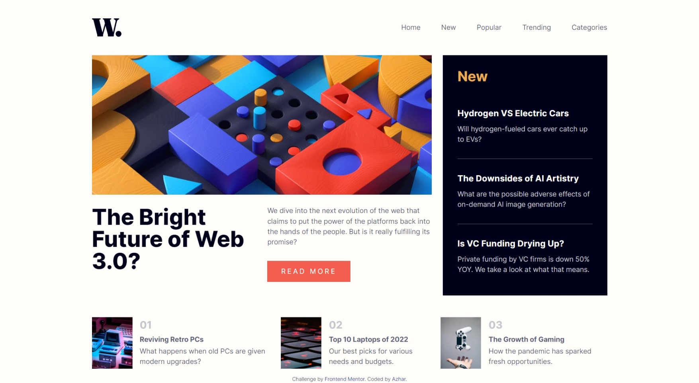
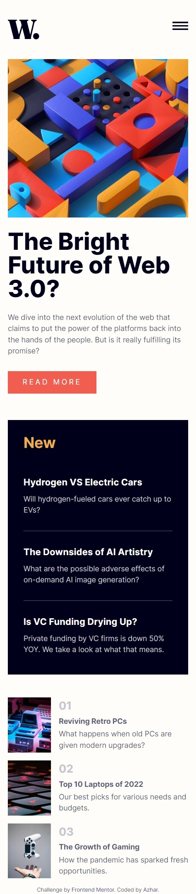

# Frontend Mentor - News homepage solution

This is a solution to the [News homepage challenge on Frontend Mentor](https://www.frontendmentor.io/challenges/news-homepage-H6SWTa1MFl). Frontend Mentor challenges help you improve your coding skills by building realistic projects. 

## Table of contents

- [Overview](#overview)
  - [The challenge](#the-challenge)
  - [Screenshot](#screenshot)
  - [Links](#links)
- [My process](#my-process)
  - [Built with](#built-with)
- [Author](#author)

**Note: Delete this note and update the table of contents based on what sections you keep.**

## Overview

### The challenge

Users should be able to:

- View the optimal layout for the interface depending on their device's screen size
- See hover and focus states for all interactive elements on the page

### Screenshot
Desktop design  

Mobile Design  

Then crop/optimize/edit your image however you like, add it to your project, and update the file path in the image above.

### Links

- Solution URL: [Github code link](https://github.com/azhar1038/frontendmentor/tree/main/news-homepage)
- Live Site URL: [Github page link](https://azhar1038.github.io/frontendmentor/news-homepage)

## My process

### Built with

- Vanilla JS and CSS
- Semantic HTML5 markup
- Accessibility
- CSS custom properties
- Flexbox
- Grid
- Mobile-first workflow

## Author

- Github - [Md Azharuddin](https://github.com/azhar1038)
- Frontend Mentor - [@azhar1038](https://www.frontendmentor.io/profile/azhar1038)
