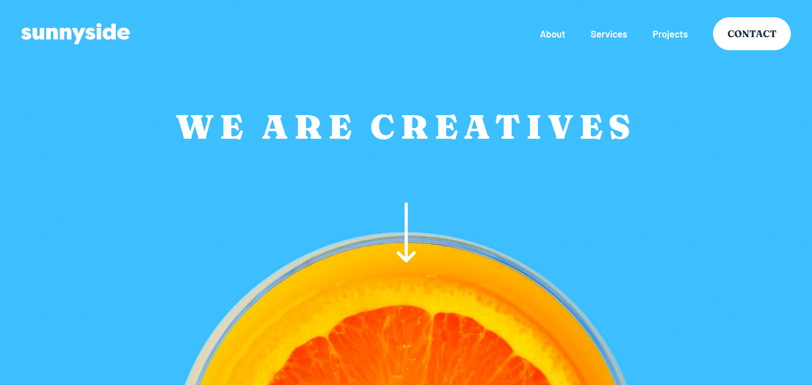
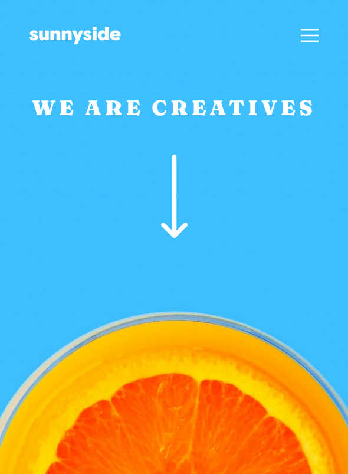

# Frontend Mentor - Sunnyside agency landing page solution

This is a solution to the [Sunnyside agency landing page challenge on Frontend Mentor](https://www.frontendmentor.io/challenges/sunnyside-agency-landing-page-7yVs3B6ef). Frontend Mentor challenges help you improve your coding skills by building realistic projects.

## Table of contents

- [Overview](#overview)
  - [The challenge](#the-challenge)
  - [Screenshot](#screenshot)
  - [Links](#links)
- [My process](#my-process)
  - [Built with](#built-with)
  - [What I learned](#what-i-learned)
- [Author](#author)

## Overview

### The challenge

Users should be able to:

- View the optimal layout for the site depending on their device's screen size
- See hover states for all interactive elements on the page

### Screenshot

Solution in Desktop

Solution in Mobile

### Links

- Solution URL: [Github code link](https://github.com/azhar1038/frontendmentor/tree/main/sunnyside-agency-landing-page)
- Live Site URL: [Github page link](https://azhar1038.github.io/frontendmentor/sunnyside-agency-landing-page)

## My process

### Built with

- Vanilla JS and CSS
- Semantic HTML5 markup
- Accessibility
- CSS custom properties
- Flexbox
- Grid
- Mobile-first workflow

### What I learned

- How to create equal columns using Flex and how padding can mess it up

## Author

- Github - [Md Azharuddin](https://github.com/azhar1038)
- Frontend Mentor - [@azhar1038](https://www.frontendmentor.io/profile/azhar1038)
